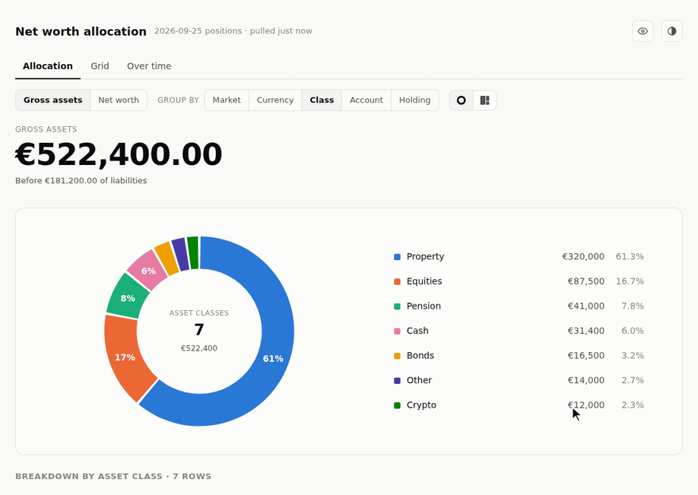

# sure-networth

A net-worth allocation donut for [Sure](https://github.com/we-promise/sure), which has none: market or currency → asset class → account → holding, with click-to-drill, a gross-assets / net-worth toggle, exclusions, a private mode that hides amounts but keeps percentages, and the same cut over the last 1, 3 or 5 years.



The demo runs on made-up data in [`docs/demo-data.json`](docs/demo-data.json); regenerate it with `nix develop .#demo -c python3 docs/record-demo.py`.

Every visitor signs in to Sure with their own account (OAuth, PKCE, `read` scope) and sees their own family's numbers. The server keeps no data, no keys and no sessions: the browser holds the token for the life of the tab and passes it along on each request, and the server fetches from Sure, computes, and forgets.

## How it works

```
browser ──OAuth──▶ Sure                    (sign-in, token stays in the tab)
browser ──Bearer──▶ sure-networth ──▶ Sure  (/api/v1 accounts, holdings, securities, balance_sheet)
                                   ──▶ ECB  (FX cross-check, frankfurter.dev)
```

- **Holdings date.** Sure only gapfills holdings up to its own day, so a date with none falls back to the newest day that has them. Without that, every securities account would render as 100% cash.
- **Brokerage cash** is balance minus holdings, not Sure's `cash_balance`, which is computed against a different day than the holdings.
- **FX.** The API returns balances in each account's own currency. `/balance_sheet` totals them at Sure's own rate, so with one foreign currency per side that rate is solved exactly and the page reconciles to Sure to the cent. ECB rates cross-check the solve (±2%) and cover anything it can't. The footer names the source of each rate.
- **Reconciliation.** The leaf total is checked against `/balance_sheet` assets; a gap over 1 shows as a footer warning.

## Setup

Start it with only `SURE_URL` set and open it: with no client configured, `/` leads to onboarding, which walks through the steps below. With one configured, `/` goes straight to the Sure login.

1. **Create a read-only OAuth client** in Sure at `/oauth/applications/new`. That page is open only to the instance's `super_admin` (the first account on the instance), not to family admins: redirect URI is this server's address with a trailing slash (`https://networth.example.com/`), *Confidential* unticked, scope `read`. Sure only redirects to https or loopback http.
   Without `super_admin`, onboarding can register one through Sure's public `/register`, but Sure grants those `read_write` only. Either narrow it on the Sure server —
   `bin/rails runner 'Doorkeeper::Application.find_by!(uid: "<id>").update!(scopes: "read")'` — or set `SURE_OAUTH_SCOPE=read_write`.
2. **Set `SURE_OAUTH_CLIENT_ID`** and restart.

If you weren't logged in to Sure, its login lands on the Sure dashboard rather than resuming the sign-in, so open the page again afterwards.

| Variable | Default | |
| --- | --- | --- |
| `SURE_URL` | — | Sure as browsers reach it |
| `SURE_OAUTH_CLIENT_ID` | — | empty → onboarding |
| `SURE_OAUTH_SCOPE` | `read` | |
| `NETWORTH_MAPPING` | — | path to the mapping file |
| `NETWORTH_BIND` | `0.0.0.0:8080` | |
| `TZ` | | "today" when the browser doesn't say |
| `RUST_LOG` | `sure_networth=info` | |

## Mapping

Sure has no asset class on accounts or securities, so unmapped accounts fall back to their type (depository → Cash, investment → Equities, crypto → Crypto, property → Property, anything else → Other) and are named in a footer warning. A JSON file assigns classes:

```json
{
  "accounts": {
    "Broker":       { "class": "Equities", "cash": "split" },
    "Broker bonds": { "class": "Bonds", "cash": "split" },
    "Pension":      { "class": "Pension" },
    "Flat":         { "class": "Property" },
    "Current":      { "class": "Cash", "group": "Current accounts" }
  },
  "netting": { "Mortgage": "Flat" }
}
```

- `class`: one of Property, Equities, Pension, Bonds, Cash, Crypto, Other (colour slots follow this order).
- `cash: "split"` peels a brokerage account's uninvested cash into Cash. The default, `keep`, leaves the whole balance in the account's class, which is right for accounts that report their value as cash (pension pillars, crowdfunding).
- `group` is the label within Cash.
- `netting` subtracts a liability from the asset it financed in net-worth mode; unlisted liabilities are shown as not netted.

The file is **re-read whenever it changes**; no restart. A file that fails to parse is logged and the previous mapping kept. In Kubernetes the chart renders it into a ConfigMap mounted as a directory, so `helm upgrade` with new mapping values reaches the running pod on the kubelet's next sync.

**Market** (Europe / United States / Global) needs no mapping: it comes from each security's country, then its MIC, then the account currency; `CRYPTO:*` is Global.

**Currency** is what each holding is priced in, or the account's currency for cash and whole accounts.

A **Treemap** toggle swaps the donut for tiles sized by value, which keeps every row visible at account and holding level where the donut folds the tail into "Other".

**Market × asset class** (or currency × asset class) is a grid of the same leaves, shaded by value; clicking a cell drills to the accounts in it.

**Over time** rebuilds the allocation at each past month-end (quarter-end for 3 and 5 years) from Sure's daily `/balances` and `/holdings`, converted at that day's ECB rates. It follows the current cut, basis and exclusions, and is not available in a `render`ed static page.

## Run

```sh
# docker
SURE_URL=https://sure.example.com NETWORTH_CONFIG_DIR=~/.config/sure-networth \
  docker compose up -d --build   # http://127.0.0.1:8732, reads $NETWORTH_CONFIG_DIR/mapping.json

# helm
helm install sure-networth oci://ghcr.io/rtammekivi/sure-networth/sure-networth-chart \
  --set sure.url=https://sure.example.com \
  --set sure.oauthClientId=<id> \
  --set ingress.enabled=true --set 'ingress.hosts[0].host=networth.example.com' \
  -f mapping-values.yaml
```

where `mapping-values.yaml` holds `mapping.accounts` / `mapping.netting` in the shape above, or `mapping.existingConfigMap` names a ConfigMap holding `mapping.json`.

### Standalone page

`render` bakes the data into a single HTML file that opens over `file://` with no server, using an API key instead of OAuth:

```sh
SURE_URL=https://sure.example.com SURE_API_KEY=... \
  sure-networth render --mapping mapping.json [--date YYYY-MM-DD] [--fx USD=0.88] [-o networth.html] [--open]
```

It prints warnings and the reconciliation to stderr. `--date` is taken literally, with no fallback.

## Development

```sh
nix develop
cargo test
cargo clippy --all-targets -- -D warnings
cargo run -- serve
```

Releases are cut by release-please from conventional commits; a release builds the multi-arch image and pushes the chart to `oci://ghcr.io/<repo>/sure-networth-chart`.
